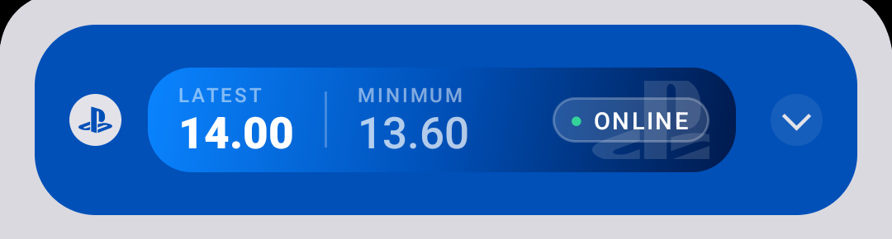
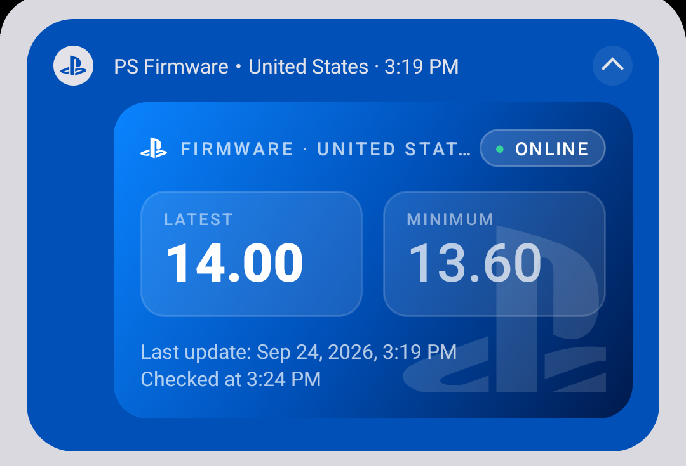
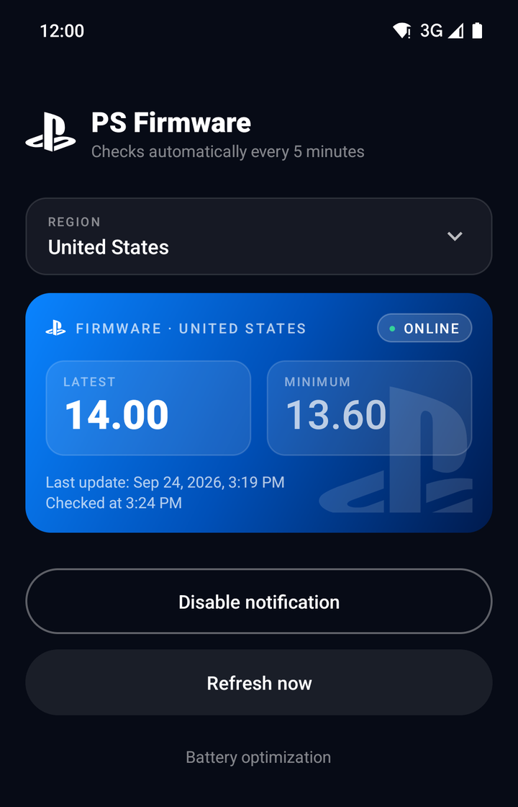

# PS Firmware

A small Android app that keeps an **ongoing notification** with the current PlayStation firmware status for the region you choose: the **latest** and **minimum** firmware versions, whether the region is **online**, and when the data was last updated.

<p align="center">
  <a href="https://github.com/SkyWallKing/PSFirmware/releases/latest/download/PSFirmware.apk">
    
  </a>
  <br>
  <a href="https://github.com/SkyWallKing/PSFirmware/releases/latest">
    
  </a>
</p>

> [!WARNING]
> **This app was heavily vibe coded.** It does its job, but it hasn't been through a serious code review or much testing on real devices. Use it at your own risk.

## Screenshots

| Notification | Notification (expanded) | App |
|:---:|:---:|:---:|
|  |  |  |

## Features

- **Ongoing notification**: updates the same notification in place and doesn't post new ones. It sits in the main section of the shade, above silent notifications, and makes no sound.
- **Updates every 5 minutes** while the phone is awake, and right away when you turn on or unlock the screen. An alarm acts as a fallback while the phone is asleep.
- **Region picker**: on first launch the app asks which region to check: Brazil, United States, Japan, Europe, United Kingdom, South Korea, Mexico, Australia, Saudi Arabia, Taiwan, Russia, China or Hong Kong.
- **Notification in the region's language** (Portuguese for Brazil, Japanese for Japan, and so on). The app itself is always in English.
- **Home screen widget**: long-press the home screen → *Widgets* → *PS Firmware*. Resize it freely: small sizes (like 1x1 or 2x1) show just the minimum version, big enough to read, a wide one-row widget shows latest, minimum and status, and taller sizes show the full card with the last update time. It works even with the notification turned off (it then refreshes every 30 minutes, the fastest Android allows for widgets); with the notification on, it updates with it every 5 minutes. Tap the ↻ button to refresh right away, or anywhere else to open the app.
- **Icon widget**: a 1x1 widget that looks like an app icon, with the minimum version in large text. (Android doesn't let apps draw text on their real launcher icon, so this is the closest thing.)
- **Dynamic theme** (optional): the notification, its icon, the widgets and the app turn **green** when the minimum version matches the latest, and **red** when it doesn't. The app shows an animated preview of how it works.
- **What's new**: after an update the app shows what changed, and the update card lets you see the changes before installing. The full history is under *What's new* at the bottom of the app (source: [`changelog.md`](app/src/main/assets/changelog.md)).
- **Automatic updates**: checks GitHub for new releases when you open the app and every 12 hours. When there's a new version you get a notification, and one tap downloads and installs it (Android asks you to confirm).
- Comes back after a reboot, and reappears if you swipe it away.
- No accounts, no ads, no tracking. The app only calls the public firmware API and the GitHub releases API.

## Install

1. Download [`PSFirmware.apk`](https://github.com/SkyWallKing/PSFirmware/releases/latest/download/PSFirmware.apk) from the [latest release](https://github.com/SkyWallKing/PSFirmware/releases/latest) on your phone (Android 8.0 or newer).
2. Open it and allow installing from unknown sources if Android asks.
3. Open **PS Firmware**, pick a region and tap **Enable notification**.

**Tip:** if updates are slow on your phone (common on Samsung, Xiaomi and other brands with aggressive battery saving), tap **Battery optimization** in the app and set PS Firmware to *Unrestricted*.

## Build from source

You need JDK 17+ and the Android SDK (platform 35).

```bash
export ANDROID_HOME=/path/to/Android/Sdk   # or create local.properties with sdk.dir=...
./gradlew assembleRelease
# APK: app/build/outputs/apk/release/app-release.apk
```

The release build is signed with the debug key so it can be installed directly.

## Credits

- Firmware data provided by **slopcheck** through the API at [psn.etawen.lol](https://psn.etawen.lol/api/v1/firmware). Thank you!

## Disclaimer

This is an unofficial fan project. It is not affiliated with, endorsed by or sponsored by Sony Interactive Entertainment. "PlayStation" and the PlayStation logo are trademarks of Sony Interactive Entertainment Inc.
